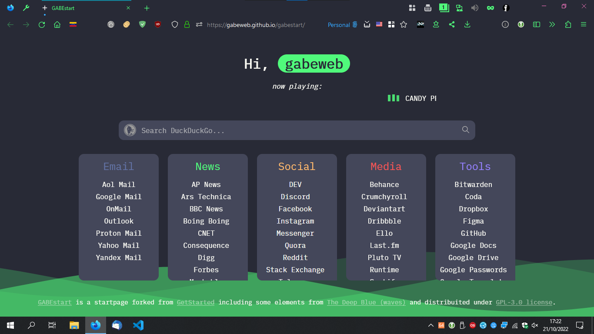
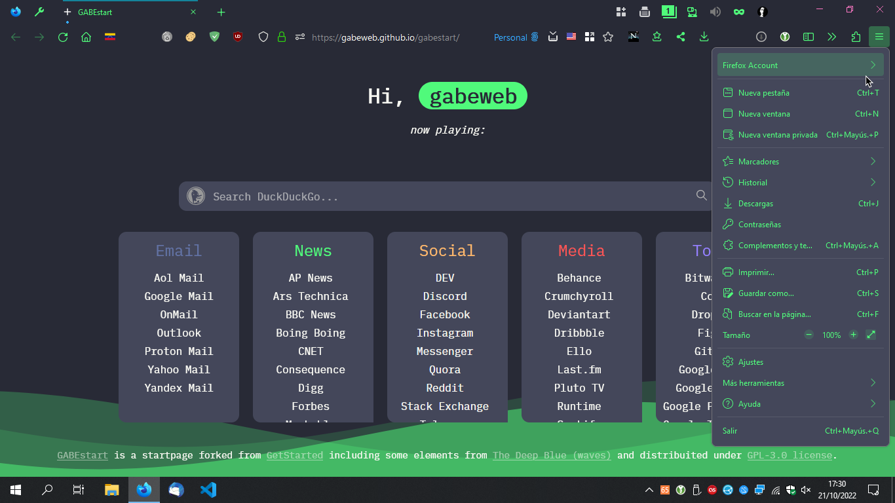

# gabeChrome.css + gabeContent.css

<em>gabeChrome.css + [WaveFox](https://github.com/QNetITQ/WaveFox) in Mozilla Firefox Developer Edition 107 and [Dracula X GABE](https://addons.mozilla.org/en-US/firefox/addon/dracula-x-gabe/) theme for Firefox</em>

Minimal customizations for modern versions of [Mozilla Firefox](https://www.mozilla.org/en-US/firefox/new/) and [LibreWolf](https://librewolf.net/).

**Free download [from here](https://github.com/gabeweb/gabeChrome.css/archive/refs/heads/main.zip)!**

## Key Features

<em>gabeChrome.css and `go-buttom` in URL bar, `tab counter` and verify icon in green</em>

- Only show close buttons ❌ on background tabs when hovering with the mouse
- URL bar `go-button` ➡ (as old-school Firefox)
- Tab counter + show tab manager button even when tabs aren't overflowing
- Verify icon gray ⚫ to green 🟢
- Move `Find Bar` above the page (why not?) for Google Chrome `new kids on the Firefox block`
- `Status Panel` in another color
- Hide the email address in the `hamburger menu`
- Grid view for `overflow menu`
- Show percentage download progress (experimental)
- **NEW:** `userContent.css` file for hiding search box in default Firefox / LibreWolf page

<em>Grid view for overflow pane</em>

<em>Hiding email address in Firefox menu</em>

## Compatibility

- As october 2022: tested in Mozilla Firefox 106+ / LibreWolf 105+
- Can be used with other `userChrome.css` and `userContent.css` tweaks.

## How-To Apply?

1. Your must enable via `about:config` the `toolkit.legacyUserProfileCustomizations.stylesheets` in Mozilla Firefox or LibreWolf.

2. Save the `gabeChrome.css` and `gabeContent.css` files as your `userChrome.css` and ``userContent.css` (if you don't have another `userChrome.css` and `userContent.css` previously, otherwise you can import it into your actual style files) and the `gabeChrome-extras.css`file, all of them in the `chrome` folder of your profile directory: `Roaming\Mozilla\Firefox\Profiles\[User]\chrome` ==> `(%APPDATA%\Mozilla\Firefox\Profiles\` on Windows or go to `about:profiles` in Firefox/LibreWolf and locate the `Roaming` folder of your profile.[^1]

3. Restart your browser and enjoy.

## Credits

Not for me but the whole [r/FirefoxCSS](https://www.reddit.com/r/firefoxcss/) community always helping to make Firefox (and LibreWolf) our own.

[^1]:For more details please refer to: *[Firefox advanced customization and configuration options](https://support.mozilla.org/en-US/kb/firefox-advanced-customization-and-configuration#firefox:win10:fx106)* and *[Profiles - Where Firefox stores your bookmarks, passwords and other user data](https://support.mozilla.org/en-US/kb/profiles-where-firefox-stores-user-data)* in the official [Firefox Help](https://support.mozilla.org/en-US/questions).

---

[more stuff from [GABEweb @ GitHub](https://gabeweb.github.io)]
